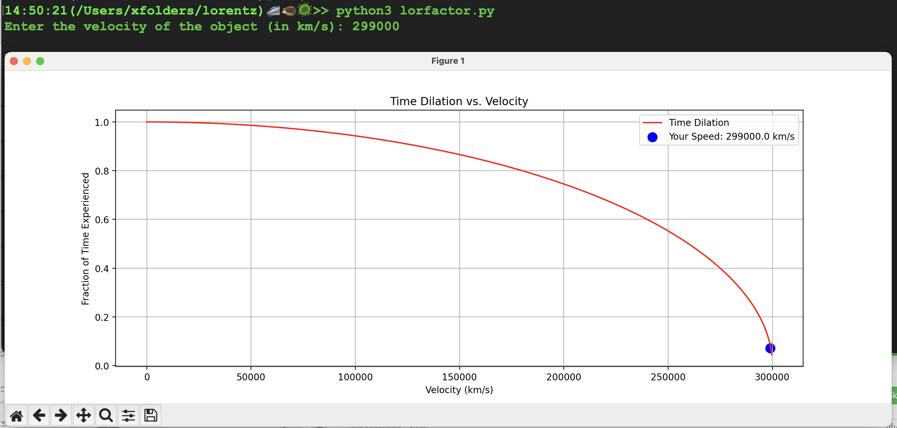

### The Lorentz factor is the factor by which 
time
length
and mass change for an object moving at speeds close to the speed of light (relativistic speeds)

This script calculates the Lorentz factor (γ) for a given velocity and creates a graph of time dilation vs. velocity.
The closes the velocity is to the speed of light:

***The more time dilation occurs. ex:  299,792 k/s = 1 year for a stationary observer only 0.64 days pass for the moving object.**

**At the speed of Light**

**Speed of 1Km/s**

## How to run

on the Command line (tested on MacOS)
*python3 lorfactor.py* 

Will ask for speed. See picture below

Note: Some of this code was generated with Deepseek & Chatgpt (The Graph)
